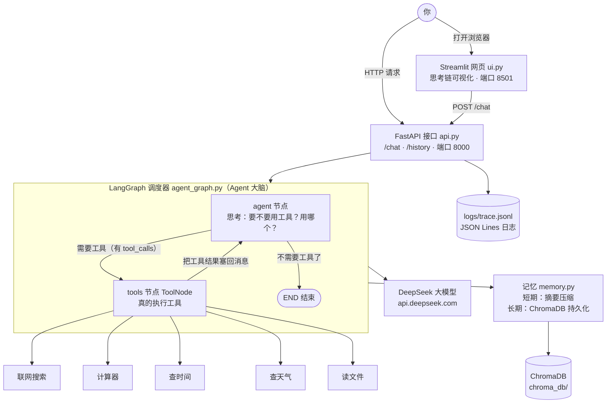

# 项目二 · Agent 智能助手系统

一句话：**你说一句任务，AI 自己去挑工具、自己动手、看结果、再决定下一步——直到把事办完。**
项目一是"AI 拿着你给的资料回答问题"（像图书管理员），项目二是"AI 自己想办法"（像助理）。

---

## 一、功能

- **5 个工具**：联网搜索 / 计算器 / 查时间 / 查天气 / 读文件（每个就是一个普通函数，登记在 `TOOLS` 列表里）
- **ReAct 循环**：想（Thought）→ 做（Action）→ 看结果（Observation）→ 再想，用 LangGraph 画成图来跑
- **记忆模块（独立，见 `memory.py`）**：短期记忆（对话太长自动压成摘要）+ 长期记忆（"我叫小徐"这类事实存进 ChromaDB，下次开新会话还记得）
  > ⚠️ **实话实说**：这个模块**代码完整、能单独跑通**，但**目前还没被 `api.py` / `agent_graph.py` import 进主链路**——
  > 也就是说，主链路的 `/chat` 现在是无状态、不记历史的。接入是下一步的活。
  > 别人问起就直说：**"记忆模块我独立实现并验证过了，主链路接入是下一步。"**——不夸大、也不含糊。
- **自愈模块（独立，见 `robust_tools.py`）**：工具调用失败自动重试（指数退避）；参数写错了，把报错还给 AI 让它自己改
  > ⚠️ 同上：独立模块，**未接入主链路**。
- **思考链可见**：网页上能逐步看到 AI 在想什么、调了哪个工具、工具返回了什么
- **对外接口**：FastAPI 提供 `/chat`（提问）和 `/history`（查历史），每一步写 JSON Lines 日志（`logs/trace.jsonl`）
- **一键启动**：`docker compose up` 起整套系统（接口 + 网页）

---

## 二、架构图

> 下面这段是 mermaid 图（GitHub 网页、VS Code 装个 mermaid 插件都能自动渲染成图；渲染不出来就直接看后面的文字版）。



**文字版（图渲染不出来时看这个）**

```
你（浏览器 / curl）
   │
   ├── Streamlit 网页（ui.py，端口 8501）──┐
   │                                       │ POST /chat
   └── FastAPI 接口（api.py，端口 8000）───┤
                                           ▼
                            LangGraph 调度器（agent_graph.py）
                                           │
                         ┌─────────────────┴─────────────────┐
                         ▼                                   │
                  agent 节点（思考）                          │
                   要不要调工具？                              │
                         │                                   │
            有 tool_calls │            没有 tool_calls        │
                         ▼                    ▼               │
                  tools 节点（执行工具）      END 结束          │
                         │                                   │
                         └── 把结果塞回消息 ──────────────────┘
                                  （循环，直到不用工具）

     工具：联网搜索 · 计算器 · 查时间 · 查天气 · 读文件
     记忆：短期=摘要压缩  长期=ChromaDB（chroma_db/）
     模型：DeepSeek（api.deepseek.com）
```

---

## 三、Agent 执行流程图（一次提问到底发生了什么）

以提问 **"现在几点？"** 为例：

```
[1] 你提问
     │  浏览器输入 → POST /chat  {"question": "现在几点？"}
     ▼
[2] api.py 收到请求
     │  把问题包成 {"messages": [{"role":"user","content":"现在几点？"}]}
     ▼
[3] agent 节点（模型第一次思考）
     │  模型看到工具清单（因为有 bind_tools 那一步，它才知道有工具）
     │  模型回答：我不直接说话，我要调 get_time 这个工具
     │  → AIMessage.tool_calls = [{"name":"get_time","args":{...}}]
     ▼
[4] 条件边 tools_condition 判断
     │  有 tool_calls → 走 tools 节点
     ▼
[5] tools 节点（ToolNode 真的执行）
     │  真的调用 get_time() 拿到 "2026-09-25 14:30:00"
     │  包成 ToolMessage 塞回消息列表
     ▼
[6] 回到 agent 节点（模型第二次思考）
     │  它看到工具结果，这次不用再调工具了
     │  → AIMessage.tool_calls = []（★空列表，这就是判断"这轮没调工具"的依据）
     ▼
[7] 条件边判断：没有 tool_calls → END
     │
     ▼
[8] api.py 取 messages 最后一条的 .content 作为答案
     │  写一行 JSON 到 logs/trace.jsonl，返回 {"answer": "现在是 14:30"}
     ▼
[9] 网页把每一步渲染出来（用户能看见"它调了 get_time"）
```

**容易被追问的三个点（本机真踩过）：**

| 追问 | 答案 |
|---|---|
| 怎么判断"这一轮到底调没调工具"？ | 累加遍历**所有** message 的 `len(m.tool_calls or [])`。最后那条 AIMessage 的 tool_calls 是 `[]`，只看 `messages[-1]` 永远判错。 |
| 不写 `bind_tools` 会怎样？ | 模型根本不知道有工具，`tool_calls` 永远是 `[]`，图能跑但一个工具都不调。 |
| 工具函数为什么要写三引号说明？ | 那个不是给人看的注释，是发给大模型的"说明书"（description），模型靠它决定用不用。没写会直接 `ValueError: Function must have a docstring`。 |

---

## 四、目录结构

```
agent_system/                     ← 项目根目录（就是本文件所在目录）
├── tools.py                      # 5 个工具函数 + TOOLS 注册表（工具就是一个普通函数）
├── agent_graph.py                # LangGraph 建图：agent 节点 + tools 节点 + 条件边
├── api.py                        # FastAPI 接口：/chat、/history + JSON Lines 日志
├── ui.py                         # Streamlit 网页：思考链可视化
├── thought_chain.py              # 把 messages 整理成"一步一步"（纯逻辑，不含 streamlit）
├── memory.py                     # 双记忆：短期摘要压缩 + 长期 ChromaDB 持久化（独立演示，还没接进 api.py）
├── robust_tools.py               # 自愈：重试、指数退避、参数修正、兜底（独立演示，还没接进 api.py）
├── tools5.py                     # Day44：工具强化版（联网搜索带降级链：ddgs 不行就换 duckduckgo_search）
├── mcp_server.py                 # Day48：用 FastMCP 把工具暴露成标准协议给别的 AI 用
├── mcp_client.py                 # Day48：MCP 客户端，去连上面的 server
├── agent_eval.py                 # 评测：任务正确率 + 工具调用成功率
├── eval_stats.py                 # Day51：读 logs/trace.jsonl 算统计（成功率 / 工具调用率 / 平均耗时）
├── edge_cases.py                 # Day53：20 个极端场景边界测试
├── test_scenarios.py             # Day45：早期场景测试
├── requirements.txt              # 依赖清单（版本号按本机实际装到的写）
├── Dockerfile                    # 打包配置（先 COPY requirements 再装依赖，用好层缓存）
├── docker-compose.yml            # 一条命令起 api + ui 两个服务
├── .dockerignore                 # 哪些文件不进镜像（.env 绝不进！）
├── .env                          # 真实密钥（★不进 Git、不进镜像）
├── .env.example                  # 密钥模板（可以进 Git）
├── .gitignore                    # .env / chroma_db / logs 不上传
├── chroma_db/                    # 长期记忆的向量库数据（memory.py 里写的是 ./chroma_db，本地生成）
├── logs/
│   └── trace.jsonl               # 运行日志（一行一条 JSON，api.py 每次请求追加一行）
├── results.json / results.csv    # edge_cases.py 跑出来的评测结果
├── docs/                         # 截图放这儿（第六节引用）
├── git_commands.txt              # 常用的 git 命令（提交、打标签、推上去）
├── resume_star.md                # 简历上怎么写这个项目（STAR 结构草稿）
├── resume_v1.md                  # 简历初版：两个项目的 STAR 素材（含"每个数字从哪来"对照表）
├── 启动API服务.bat                # 双击就起 uvicorn（省得手敲命令）
├── README.md                     # 本文件
└── 演示视频脚本.md                # 演示视频怎么录（逐句台词 + 自查清单）
```

---

## 五、怎么跑起来

### 准备：先把密钥填好

把 `.env.example` 复制一份改名成 `.env`，填上自己的 key：

```
DEEPSEEK_API_KEY=你的密钥
```

> `.env` 已被 `.gitignore` 和 `.dockerignore` 双重忽略——**绝不会**上传 GitHub，**也绝不会**打进镜像。

### 方式一：本地直接跑（开发时用，改代码立刻生效）

```bash
pip install -r requirements.txt -i https://pypi.tuna.tsinghua.edu.cn/simple

# 终端1：起接口
uvicorn api:app --reload
# 打开 http://127.0.0.1:8000/docs ，能在页面上点按钮测 /chat

# 终端2：起网页
streamlit run ui.py
# 浏览器自动打开 http://localhost:8501
```

### 方式二：Docker 一键启动（演示/交付时用）

```bash
docker compose up --build      # 第一次会构建镜像，慢一点；之后改代码不用重建
# 起好后：
#   网页   http://localhost:8501
#   接口   http://localhost:8000/docs
# 停掉： docker compose down     （Ctrl+C 是只停前台，down 才是删容器）
```

> ⚠️ **本机（徐云华的电脑）目前没装 Docker，所以 docker 这条路我还没能真机验证过。**
> Dockerfile 和 compose 是按标准写法写的、语法也校验过了，但"能不能 build 成功"必须等你装完 Docker Desktop 自己跑一遍才算数。

### 装完 Docker Desktop 后，先跑这三条命令验证

| # | 命令 | 预期输出（大概长这样） | 说明 |
|---|---|---|---|
| 1 | `docker --version` | `Docker version 27.3.1, build ce12230` | 版本号数字不用一样，能打出版本号就说明命令有了 |
| 2 | `docker compose version` | `Docker Compose version v2.30.3` | ★注意是 `docker compose`（中间空格，新版）；老教程写 `docker-compose`（中间横杠）已经过时 |
| 3 | `docker run hello-world` | `Hello from Docker!` 加一大段说明 | 这条最关键：能拉镜像+能跑容器，说明虚拟化/WSL2 都正常 |

三条都过了，再进项目目录跑：

```bash
cd 每日练习/agent_system
docker compose up --build
```

预期：终端刷出两个服务的日志，`agent-api` 出现 `Uvicorn running on http://0.0.0.0:8000`，`agent-ui` 出现 `You can now view your Streamlit app`。浏览器开 8501 能看到网页 = 成功。

**如果 Windows 上装完 Docker 起不来**：90% 是虚拟化没开。打开"任务管理器 → 性能 → CPU"，看右下角"虚拟化"是不是"已启用"；没启用要进 BIOS 打开，然后确认 WSL2 装好（`wsl --install`）。

---

## 六、截图位置（占位，录演示前把图补上）

> 把下面的占位换成自己的截图（截图放 `docs/` 文件夹，Markdown 里用 `` 引进来）。

**图1 · 网页界面整体**
`[截图占位：http://localhost:8501 首页，能看到标题和输入框]`

**图2 · Agent 思考链展开（演示最出彩的一张）**
`[截图占位：点开 st.expander，能看到 "思考 → 调用 get_time → 结果 14:30" 的每一步]`

**图3 · FastAPI 接口调试页**
`[截图占位：http://localhost:8000/docs ，能看到 /chat 和 /history 两个接口]`

**图4 · 一条命令启动成功**
`[截图占位：终端里 docker compose up 的输出，两个服务都 running]`

---

## 七、设计取舍 FAQ（为什么这么做）

**Q：这个项目和项目一的 RAG 有什么区别？**
A：项目一是"AI 拿着资料回答问题"，是被动检索——像图书管理员。项目二是"AI 自己决定下一步干什么"，是主动循环——像助理。RAG 的检索是外部资料库，Agent 的记忆是自己"记得的事"，两回事。

**Q：Agent 和"调一次函数"有什么区别？**
A：调一次函数是一条直线；Agent 是**循环**——调用 → 看结果 → 再决定下一步，直到任务完成。这个循环在代码里就是图上的条件边：有 tool_calls 就走去 tools，没有就 END。

**Q：Docker 里为什么先 COPY requirements.txt 再 pip install？**
A：利用镜像层缓存。依赖清单很少变，源码天天变。把"装依赖"锁成单独一层，改 .py 时这层缓存直接命中，构建几秒完成；反过来写，改一个字就要重装所有依赖。

**Q：容器里 api 和 ui 怎么互相通信？**
A：用**服务名**当网址（`http://api:8000`），Docker 内部 DNS 会解析成容器 IP。写 `localhost` 就变成"ui 容器自己"，永远连不上——这是最常见的坑。

**Q：密钥怎么进容器的？**
A：`env_file: .env` 在运行时注入环境变量，代码里用 `os.getenv("DEEPSEEK_API_KEY")` 读。密钥**不打进镜像**（镜像每层文件都能被人翻出来），也**不进 Git**（.gitignore）。

**Q：为什么基础镜像用 `python:3.10-slim`，不用 `latest`？**
A：`latest` 会随时间漂移，今天能构建、下个月可能就失败，构建结果不可复现。写死版本才有确定性。`slim` 是精简版，比完整版小几百 MB。

**Q：演示时怎么证明它不是"装样子"？**
A：现场 `docker compose up` 从零起，当场提一个需要联网搜索的复杂任务，让它自己选工具、自己串起来做。能现场跑，就是可信度的来源。

---

## 八、技术栈

Python 3.10 · LangGraph · LangChain · DeepSeek（OpenAI 兼容接口）· ChromaDB · FastAPI · Streamlit · Docker / Docker Compose

---

## 九、发版

- 代码提交：`git add . && git commit -m "Day54: Docker 化 + README"`
- 打标签：`git tag v1.0 && git push origin v1.0`
- 演示视频：怎么录、每步说什么，见 [演示视频脚本.md](演示视频脚本.md)
